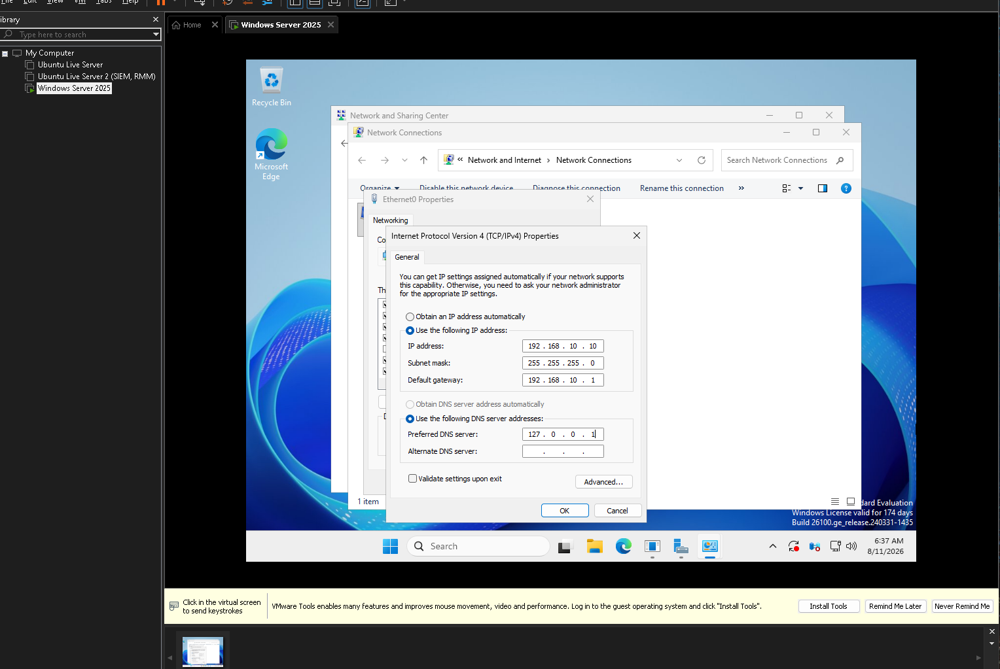
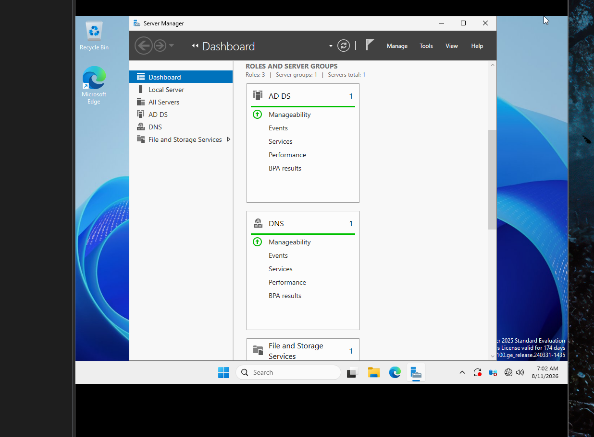
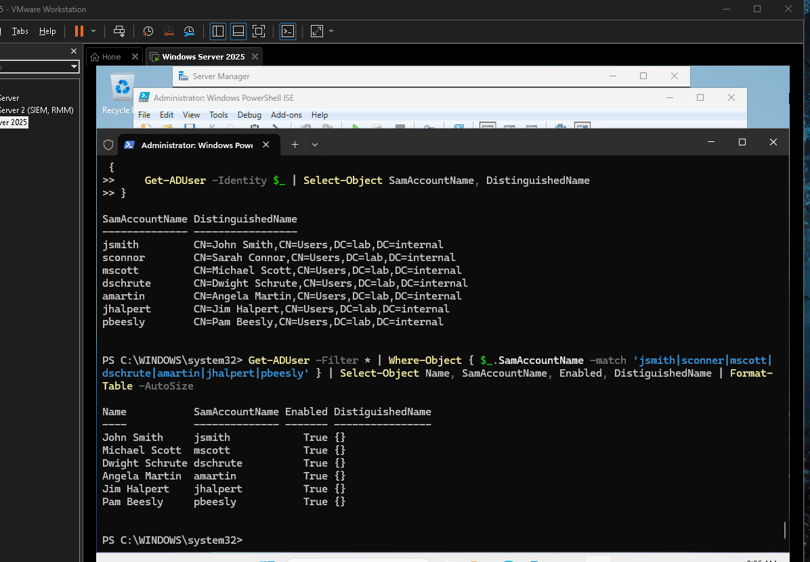
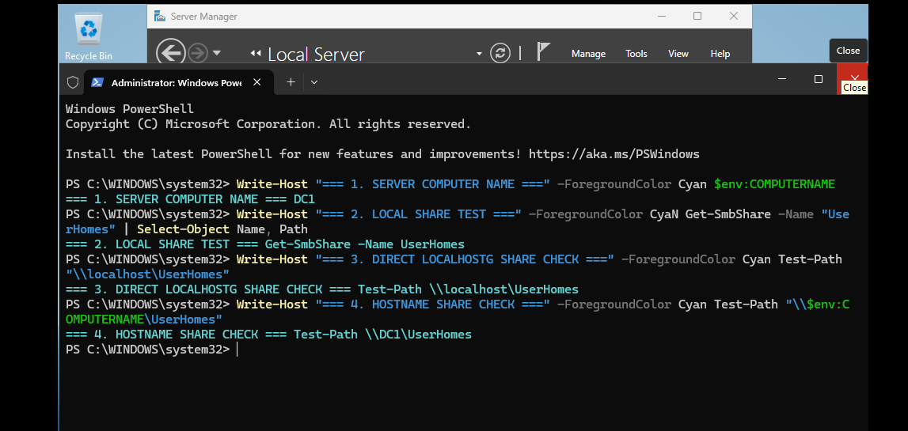

# windows-server-ad-ds
This project demonstrates the deployment, network configuration and directory structure of a Windows Server 2025 Active Directory Domain Services environment (lab.internal) built in a home lab utilizing VMs.

# Windows Server 2025 Active Directory ADDS Baseline & Automation Lab

## Project Overview
This portfolio project demonstrates the end-to-end configuration of a Windows Server 2025 Active Directory Domain Services environment (`lab.internal`) hosted within a VMware Workstation virtualized lab. The project covers foundational systems administration tasks, including static network configuration, AD DS/DNS server role installation, automated bulk-user account provisioning using PowerShell, and network SMB share validation.

---

## Technical Implementation 

### 1. Static IPv4 & DNS Loopback Configuration
Configured a static IPv4 network address (`192.168.10.10/24`) and assigned the local loopback address (`127.0.0.1`) as the primary DNS server to ensure proper Active Directory domain lookup and Kerberos authentication.

---

### 2. ADDS & DNS Server Role Installation
Promoted the server (`DC1`) to a primary Domain Controller for the `lab.internal` domain, installing both **Active Directory Domain Services (ADDS)** and **DNS Server** roles. Verified system health via Server Manager.

---

### 3. Automated User Account Provisioning via PowerShell
Executed PowerShell scripts using `Get-ADUser` to automate bulk account creation, inspect user object properties (`SamAccountName`, `UserPrincipalName`), and verify Distinguished Name OU paths.

---

### 4. SMB Network Share & Hostname Path Verification
Configured enterprise file storage shares (`UserHomes`) and executed PowerShell validation checks testing local share availability (`Get-SmbShare`) and UNC network pathing (`\\DC1\UserHomes`).

---

## Code Attribution & Acknowledgments
* **PowerShell Logic:** Built using standard Active Directory PowerShell Module cmdlets (`New-ADUser`, `Get-ADUser`) based on [Microsoft Learn ActiveDirectory Documentation](https://learn.microsoft.com/en-us/powershell/module/activedirectory/).
* **Customizations:** Configured custom parameters, target OU Distinguished Name paths, and output filtering tailored to the `lab.internal` domain environment.
